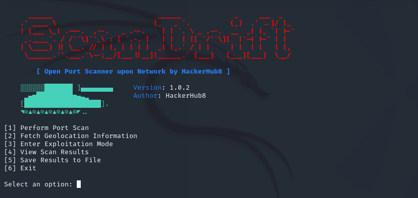

---

# ScanDrift ⚠️


░░░░░░███████ ]▄▄▄▄▄▄▄▄     
▂▄▅█████████▅▄▃▂  
[███████████████████]     
◥⊙▲⊙▲⊙▲⊙▲⊙▲⊙▲⊙◤                                                                             
ScanDrift is a comprehensive network scanning and exploitation framework designed for security professionals, network administrators, and ethical hackers. It facilitates efficient port scanning, geolocation of target IPs, and offers an interactive exploitation mode to assess potential vulnerabilities.

## Features 🛜

- **Port Scanning**: Identify open ports on target IP addresses with customizable scanning options.
- **Geolocation Lookup**: Retrieve geographical information of target IPs, including country, region, city, and ISP details.
- **Exploitation Mode**: Interactive mode to analyze and exploit detected services on open ports.
- **Result Management**: View and save scan results for future analysis.
- **User-Friendly Interface**: Clear and navigable command-line interface with menu-driven options.

## Options  🚨
 
- `[1]` Perform Port Scan
- `[2]` Fetch Geolocation Information
- `[3]` Enter Exploitation Mode
- `[4]` View Scan Results
- `[5]` Save Results to File
- `[6]` Exit


## Installation 🧑‍💻

1. **Clone the Repository**:

   ```bash
   git clone https://github.com/hacker-hub8/ScanDrift.git
   cd ScanDrift
   ```

2. **Set Up a Virtual Environment** (Optional but recommended):

   ```bash
   python3 -m venv venv
   source venv/bin/activate  # On Windows: venv\Scripts\activate
   ```

3. **Install Dependencies**:

   ```bash
   pip install -r requirements.txt
   ```

## Usage 💾

1. **Run ScanDrift**:

   ```bash
   python main.py
   ```

2. **Navigate the Menu**:

   - **Perform Port Scan**: Scan target IPs for open ports.
   - **Fetch Geolocation Information**: Retrieve geographical data of the target IP.
   - **Enter Exploitation Mode**: Analyze and exploit services on open ports.
   - **View Scan Results**: Display the results of previous scans.
   - **Save Results to File**: Export scan results for documentation.
   - **Exit**: Close the application.

## Requirements 📡

- **Python**: Version 3.6 or higher.
- **Dependencies**: Listed in `requirements.txt`.

 **FileSystem**:

   ```bash
   scandrift/
   │
   ├── main.py                # Entry point for the framework
   ├── scanner.py             # Handles port scanning
   ├── exploitation.py        # Handles exploitation of open ports
   ├── geolocation.py         # Fetches geolocation data
   ├── utils.py               # Helper functions like clearing the screen
   ├── requirements.txt       # Dependencies for the project
   ├── README.md              # Instructions for using the tool
   └── logs/                  # Directory for saving reports
   ```

## [👉 All Usage Images 👈](https://github.com/hacker-hub8/ScanDrift/tree/main/img)


*Main Menu Interface*


*Port Scanning in Progress*


*Interactive Exploitation Mode*


## [License](https://github.com/hacker-hub8/ScanDrift?tab=GPL-3.0-1-ov-file)

This project is licensed under the GNU General Public License v3.0. See the [LICENSE](https://github.com/hacker-hub8/ScanDrift?tab=GPL-3.0-1-ov-file) file for details.

---
## Notes  📝

- Ensure that you have appropriate permissions to scan the target IP address. Unauthorized scanning can be illegal and unethical.  
- Use this tool responsibly and only on networks you own or have explicit permission to test.
- Take loads when you scan outer networks
- Best Use for inside network scanning  
---
## 🌐 Follow us:

For support, email support@hackerhub8.in 
or

Join our Community [](https://instagram.com/hacker_hub8) 
